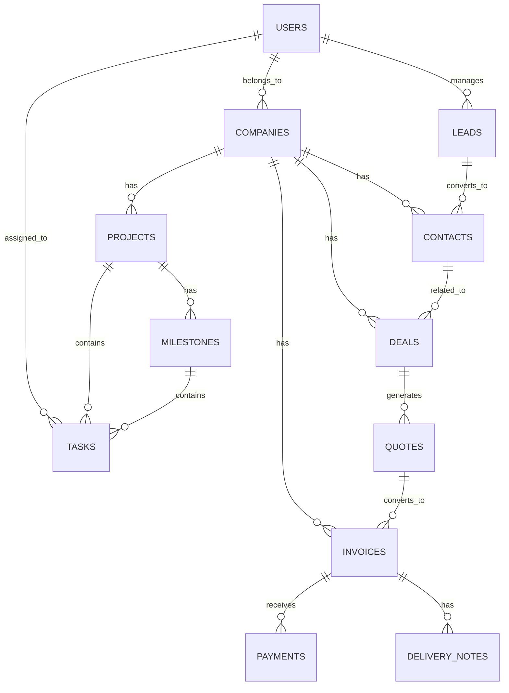

# CRM System - Arhitektura

## 📋 Pregled

CRM sistem je izgrađen kao full-stack monorepo aplikacija sa modernim tehnologijama i best practices pristupom.

## 🏗️ High-Level Arhitektura

```
┌─────────────────────────────────────────────────────────────┐
│                      Client Layer                            │
│  ┌─────────────┐                                            │
│  │  Next.js 16 │ - React 19                                 │
│  │  Web App    │ - Tailwind CSS 4.0                         │
│  │             │ - Zustand + TanStack Query                 │
│  └──────┬──────┘                                            │
└─────────┼─────────────────────────────────────────────────┘
          │ HTTP/REST
          │
┌─────────▼─────────────────────────────────────────────────┐
│                    API Gateway Layer                        │
│  ┌─────────────────────────────────────────────────────┐  │
│  │  Bun HTTP Server                                    │  │
│  │  - CORS middleware                                  │  │
│  │  - Rate limiting                                     │  │
│  │  - Authentication (JWT)                              │  │
│  │  - API key validation                                │  │
│  └─────────────────────────────────────────────────────┘  │
└─────────┬─────────────────────────────────────────────────┘
          │
┌─────────▼─────────────────────────────────────────────────┐
│                   Application Layer                         │
│  ┌──────────────┐  ┌──────────────┐  ┌──────────────┐   │
│  │   Routes     │  │  Middleware  │  │   Services   │   │
│  │              │  │              │  │              │   │
│  │ - Auth       │  │ - Auth       │  │ - Auth       │   │
│  │ - Users      │  │ - Rate Limit │  │ - CRM        │   │
│  │ - Companies  │  │ - Validation │  │ - Sales      │   │
│  │ - CRM        │  │ - CORS       │  │ - Projects   │   │
│  │ - Sales      │  │              │  │ - Reports    │   │
│  │ - Projects   │  │              │  │ - Email      │   │
│  │ - Reports    │  │              │  │ - Audit      │   │
│  └──────────────┘  └──────────────┘  └──────────────┘   │
└─────────┬─────────────────────────────────────────────────┘
          │
┌─────────▼─────────────────────────────────────────────────┐
│                     Data Layer                              │
│  ┌──────────────┐  ┌──────────────┐  ┌──────────────┐   │
│  │  PostgreSQL  │  │     Redis    │  │    BullMQ    │   │
│  │              │  │              │  │              │   │
│  │ - Main DB    │  │ - Sessions   │  │ - Email jobs │   │
│  │ - Drizzle    │  │ - Cache      │  │ - Report gen │   │
│  │   ORM        │  │ - Rate limit │  │ - Webhooks   │   │
│  └──────────────┘  └──────────────┘  └──────────────┘   │
└───────────────────────────────────────────────────────────┘
```

## 📦 Monorepo Struktura

```
crm-monorepo/
├── apps/
│   ├── api-server/        # Backend API (Bun + TypeScript)
│   └── web/               # Frontend App (Next.js 16 + React 19)
├── packages/
│   ├── types/             # Shared TypeScript types
│   └── utils/             # Shared utility functions
├── docs/                  # Documentation
└── package.json           # Workspace root
```

### Apps

#### 1. API Server (`apps/api-server/`)

Backend aplikacija napisana u Bun-u.

```
apps/api-server/
├── src/
│   ├── cache/             # Redis cache layer
│   ├── config/            # Environment & configuration
│   ├── db/                # Database schemas & migrations
│   │   ├── schema/        # Drizzle schema definitions
│   │   └── seed.ts        # Database seeding
│   ├── integrations/      # External services
│   │   ├── api-auth.ts    # API key authentication
│   │   └── email.service.ts
│   ├── jobs/              # Background jobs (BullMQ)
│   │   ├── queue.ts       # Job queue setup
│   │   └── workers.ts     # Job processors
│   ├── lib/               # Libraries
│   │   └── logger.ts      # Pino logger
│   ├── middleware/        # HTTP middleware
│   │   ├── auth.ts        # JWT auth middleware
│   │   ├── rate-limit.ts  # Rate limiting
│   │   ├── cors.ts        # CORS handling
│   │   └── validation.ts  # Request validation
│   ├── routes/            # API routes
│   │   ├── auth.ts        # Authentication endpoints
│   │   ├── users.ts       # User management
│   │   ├── companies.ts   # Company management
│   │   ├── crm.ts         # Leads, Contacts, Deals
│   │   ├── sales.ts       # Quotes, Invoices
│   │   ├── projects.ts    # Projects & Tasks
│   │   ├── products-routes.ts
│   │   ├── notifications-routes.ts
│   │   ├── payments-routes.ts
│   │   ├── reports.ts     # Reports & Analytics
│   │   ├── health.ts      # Health checks
│   │   ├── helpers.ts     # Route helpers
│   │   └── index.ts       # Route aggregator
│   ├── services/          # Business logic
│   │   ├── auth.service.ts
│   │   └── audit.service.ts
│   ├── validators/        # Zod schemas
│   │   └── schemas.ts
│   ├── __tests__/         # Tests (Vitest)
│   └── index.ts           # Entry point
├── drizzle.config.ts      # Drizzle ORM config
├── vitest.config.ts       # Test config
└── package.json
```

**Tech Stack**:
- **Runtime**: Bun 1.1.0
- **Language**: TypeScript 5.7.0
- **Database**: PostgreSQL 16 + Drizzle ORM 0.44.7
- **Cache**: Redis 7 + ioredis 5.4.1
- **Queue**: BullMQ 5.30.0
- **Logger**: Pino 9.5.0
- **Validation**: Zod 3.23.8
- **Testing**: Vitest 4.0.14

#### 2. Web App (`apps/web/`)

Frontend aplikacija sa Next.js 16 App Router.

```
apps/web/
├── src/
│   ├── app/               # Next.js App Router
│   │   ├── (auth)/        # Auth routes group
│   │   ├── (dashboard)/   # Protected dashboard routes
│   │   ├── layout.tsx     # Root layout
│   │   └── page.tsx       # Home page
│   ├── components/        # React components
│   │   ├── ui/            # Shadcn/ui components
│   │   ├── forms/         # Form components
│   │   ├── layouts/       # Layout components
│   │   └── features/      # Feature-specific components
│   ├── hooks/             # Custom React hooks
│   ├── lib/               # Utilities
│   │   ├── api.ts         # API client
│   │   └── utils.ts       # Helper functions
│   ├── store/             # Zustand stores
│   │   ├── auth.ts        # Auth state
│   │   └── ui.ts          # UI state
│   └── styles/            # CSS
│       └── globals.css    # Global styles
├── public/                # Static assets
└── package.json
```

**Tech Stack**:
- **Framework**: Next.js 16.0.1 (App Router)
- **UI Library**: React 19.2.0
- **Styling**: Tailwind CSS 4.0.0
- **Components**: Radix UI + shadcn/ui
- **State**: Zustand 5.0.0
- **Data Fetching**: TanStack Query 5.62.11
- **Forms**: React Hook Form + Zod
- **Testing**: Vitest + React Testing Library

### Packages

#### 1. Types (`packages/types/`)

Shared TypeScript type definitions.

```typescript
// Database entities
export interface User {
  id: string;
  email: string;
  firstName: string;
  lastName: string;
  role: UserRole;
  companyId?: string;
}

// API responses
export interface ApiResponse<T> {
  success: boolean;
  data?: T;
  error?: ApiError;
  pagination?: PaginationInfo;
}
```

#### 2. Utils (`packages/utils/`)

Shared utility functions.

```typescript
// UUID generation
export function generateUUID(): string;

// Date formatting
export function formatDate(date: Date): string;

// API response helpers
export function successResponse<T>(data: T): ApiResponse<T>;
export function errorResponse(code: string, message: string): ApiResponse<never>;

// Validation
export function isValidEmail(email: string): boolean;
export function isValidUUID(uuid: string): boolean;
```

## 🔐 Security Architecture

### Authentication Flow

```
1. User Login
   ↓
2. Validate Credentials (bcrypt)
   ↓
3. Generate JWT Token (HS256)
   ↓
4. Create Redis Session
   ↓
5. Set HttpOnly Cookies
   ├── access_token (15 min)
   ├── refresh_token (7 days)
   └── session_id (7 days)
   ↓
6. Return User Data
```

### Authorization Levels

1. **Public** - No authentication required
   - `/health`
   - `/api/v1` (API info)

2. **Authenticated** - Valid JWT required
   - `/api/v1/auth/me`
   - `/api/v1/users/:id` (own user)
   - Most CRUD operations

3. **Role-Based** - Specific role required
   - **Admin Only**:
     - User management
     - System stats
     - Job management
   - **Manager**:
     - Team reports
     - Assign tasks

4. **Resource-Based** - Own resource or admin
   - User can access own data
   - Company members can access company data
   - Admin can access all

### Security Features

- ✅ JWT tokens with HS256 signing
- ✅ HttpOnly cookies (XSS protection)
- ✅ CSRF protection via SameSite cookies
- ✅ bcrypt password hashing (cost 12)
- ✅ Rate limiting (IP + user based)
- ✅ Redis session storage
- ✅ API key authentication for integrations
- ✅ Input validation (Zod schemas)
- ✅ SQL injection protection (parameterized queries)
- ✅ CORS configuration
- ✅ Audit logging

## 📊 Database Schema

### Core Entities



### Key Tables

- **users** - System users
- **companies** - Customer companies
- **leads** - Potential customers
- **contacts** - Company contacts
- **deals** - Sales opportunities
- **quotes** - Price quotations
- **invoices** - Billing documents
- **delivery_notes** - Delivery records
- **projects** - Project management
- **milestones** - Project milestones
- **tasks** - Work items
- **products** - Product catalog
- **product_categories** - Product categories
- **payments** - Payment records
- **notifications** - User notifications
- **api_keys** - API authentication keys
- **audit_logs** - System audit trail

## 🔄 Data Flow

### Typical Request Flow

```
1. HTTP Request
   ↓
2. CORS Middleware
   ↓
3. Rate Limit Check
   ↓
4. Authentication Middleware
   ↓
5. Route Handler
   ↓
6. Request Validation (Zod)
   ↓
7. Business Logic (Service Layer)
   ↓
8. Database Query (Drizzle ORM)
   ↓
9. Cache Update (Redis)
   ↓
10. Response Formatting
    ↓
11. HTTP Response
```

### Background Job Flow

```
1. API Endpoint
   ↓
2. Queue Job (BullMQ)
   ↓
3. Redis Queue
   ↓
4. Worker Process
   ↓
5. Job Processing
   ├── Send Email
   ├── Generate Report
   └── Send Webhook
   ↓
6. Update Job Status
   ↓
7. Cleanup (if needed)
```

## 🚀 Performance Optimizations

### Caching Strategy

1. **Redis Cache**
   - Sessions (7 days)
   - Rate limit counters (sliding window)
   - API responses (TTL based)
   - User permissions

2. **Database Indexes**
   - Primary keys (UUID)
   - Foreign keys
   - Commonly queried fields (email, status, dates)

3. **Query Optimization**
   - Pagination for list endpoints
   - Selective field loading
   - N+1 query prevention
   - Connection pooling

### Scalability Considerations

1. **Horizontal Scaling**
   - Stateless API servers
   - Shared Redis for sessions
   - Database connection pooling

2. **Vertical Scaling**
   - Bun's performance (4x faster than Node.js)
   - Efficient memory usage
   - Fast startup times

3. **Background Processing**
   - Async job queues
   - Email sending
   - Report generation
   - Webhook delivery

## 🧪 Testing Strategy

### Test Pyramid

```
        /\
       /E2E\          < 10% - End-to-end tests
      /------\
     /Integration\    < 20% - API integration tests
    /------------\
   /   Unit Tests \   < 70% - Unit & component tests
  /----------------\
```

### Test Coverage

- **Unit Tests** (70%): Services, utilities, validators
- **Integration Tests** (20%): API endpoints, middleware
- **E2E Tests** (10%): Critical user flows

**Current Status**: 240 tests, 98.8% pass rate

## 📈 Monitoring & Observability

### Logging

- **Logger**: Pino (structured JSON logging)
- **Levels**: debug, info, warn, error
- **Context**: Request ID, user ID, correlation ID

### Metrics (Planned)

- Request rate
- Response times
- Error rates
- Cache hit ratio
- Queue lengths
- Database connection pool

### Alerts (Planned)

- High error rate
- Slow response times
- Queue backlog
- Database connection issues
- Redis connection issues

## 🔧 Development Tools

- **Bun**: Runtime & package manager
- **Drizzle Kit**: Database migrations
- **Drizzle Studio**: Database GUI
- **Vitest**: Testing framework
- **Biome**: Linting & formatting
- **TypeScript**: Type safety

## 🌐 Deployment Architecture (Future)

```
┌────────────────────────────────────────────┐
│            CDN / CloudFlare                │
└────────────┬───────────────────────────────┘
             │
┌────────────▼───────────────────────────────┐
│         Load Balancer (nginx)              │
└────┬───────┬───────┬──────────────────────┘
     │       │       │
┌────▼──┐ ┌──▼───┐ ┌▼────┐
│ API 1 │ │ API 2│ │ API 3│  (Horizontal scaling)
└───┬───┘ └──┬───┘ └┬────┘
    │        │      │
    └────┬───┴──────┘
         │
    ┌────▼────────┐
    │   Redis     │  (Sessions, Cache, Queue)
    │  (Managed)  │
    └─────────────┘
         │
    ┌────▼────────┐
    │ PostgreSQL  │  (Primary database)
    │  (Managed)  │
    └─────────────┘
```

## 📚 Design Patterns

### Backend Patterns

1. **Repository Pattern** - Data access abstraction
2. **Service Layer** - Business logic separation
3. **Middleware Pattern** - Request processing pipeline
4. **Factory Pattern** - Object creation
5. **Singleton Pattern** - Shared resources (DB, Redis)

### Frontend Patterns

1. **Component Composition** - Reusable UI components
2. **Custom Hooks** - Logic reusability
3. **State Management** - Zustand stores
4. **Server Components** - Next.js RSC
5. **API Routing** - Next.js API routes

## 🔮 Future Enhancements

### Planned Features

- [ ] WebSocket support for real-time updates
- [ ] GraphQL API alongside REST
- [ ] Multi-tenancy support
- [ ] Advanced analytics dashboard
- [ ] Mobile app (React Native)
- [ ] AI-powered insights
- [ ] Workflow automation
- [ ] Email templates builder
- [ ] Document management
- [ ] Advanced reporting

### Technical Improvements

- [ ] Implement OpenTelemetry tracing
- [ ] Add Prometheus metrics
- [ ] Set up Grafana dashboards
- [ ] Implement CDC (Change Data Capture)
- [ ] Add full-text search (Elasticsearch)
- [ ] Implement event sourcing
- [ ] Add CQRS pattern for reads/writes
- [ ] Implement feature flags
- [ ] Add A/B testing framework
- [ ] Implement blue-green deployment

---

**Last Updated**: 2025-12-01
**Version**: 1.0.0
